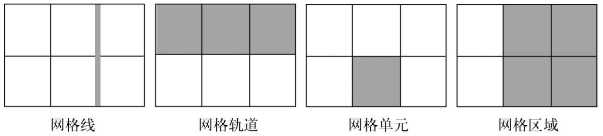
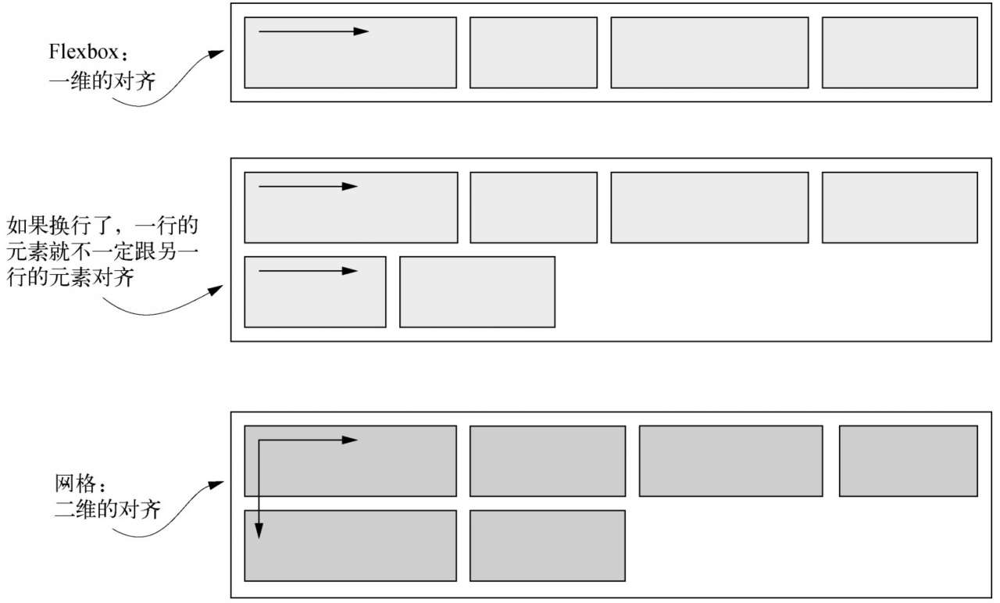

# 网格布局

CSS 网格可以定义由行和列组成的二维布局，然后将元素放置到网格中。网格的大小即可以精确定义，也可以根据自身内容自动计算。

网格布局也是作用于两级的 DOM 结构。设置为`display: grid;`的元素成为一个网格容器（grid container）。它的子元素则变成网格元素（grid items）。

```css
.grid {
  display: grid;
  grid-template-columns: 1fr 1fr 1fr;
  grid-template-rows: 1fr 1fr;
  gap: 0.5em;
}
```

首先，使用`display: grid;`定义一个网格容器。容器会表现得像一个块级元素，100%填充可用宽度。也可以使用 inline-grid（尽管这段代码没写），这样元素就会在行内流动，且宽度只能够包含子元素，不过 inline-grid 的使用频率不高。

接下来是新属性：grid-template-columns 和 grid-template-rows。这两个属性定义了网格每行没列的大小。上面代码使用了一种新单位**fr**，代表每一列（或每一行）的**分数单位**（fraction unit）。这个单位跟 Flexbox 中 flex-grow 因子的表现一样。`grid-template-columns: 1fr 1fr 1fr;` 表示三列等宽。

不一定非得用分数单位，可以使用其他的单位，比如 px、em 或百分数。也可以混搭这几种单位，例如`grid-template-columns: 300px 1pr;` 定义了一个固定宽度为 300px 的列，后面跟着一个会填满剩余可用空间的列。2fr 的列宽是 1fr 的两倍。

最后，gap 属性定义了每个网格单元之间的间距。也可以用两个值分别指定垂直和水平方向的间距。

## 网格剖析



- 网格线（grid line）：网格线构成了网格的框架。一条网格线可以水平或垂直，也可以位于一行或一列的任意一侧。如果指定了 gap 的话，它就位于网格线上。
- 网格轨道（grid track）：一个网格轨道是两条相邻网格线之间的空间。网格有水平轨道（行）和垂直轨道（列）。
- 网格单元（grid cell）：网格上的单个空间，水平和垂直的网格轨道交叉重叠的部分。
- 网格区域（grid area）：网格上的矩形区域，由一个到多个网格单元组成。该区域位于两条垂直网格线和两条水平网格线之间。

### 与 Flexbox 配合

网格布局和 Flexbox 的两个重要区别：

- Flexbox 本质上是一维的，而网格是二维的。
- Flexbox 是以内容为切入点由内向外工作的，而网格是以布局为切入点从外向内工作的。

因为 Flexbox 是一维的，所以它很适合用在相似的元素组成的行（或列）上。它支持用 flex-wrap 换行，但是没法让上一行元素跟下一行元素对齐。相反，网格是二维的，旨在解决一个轨道的元素跟另一个轨道的元素对齐的问题。


