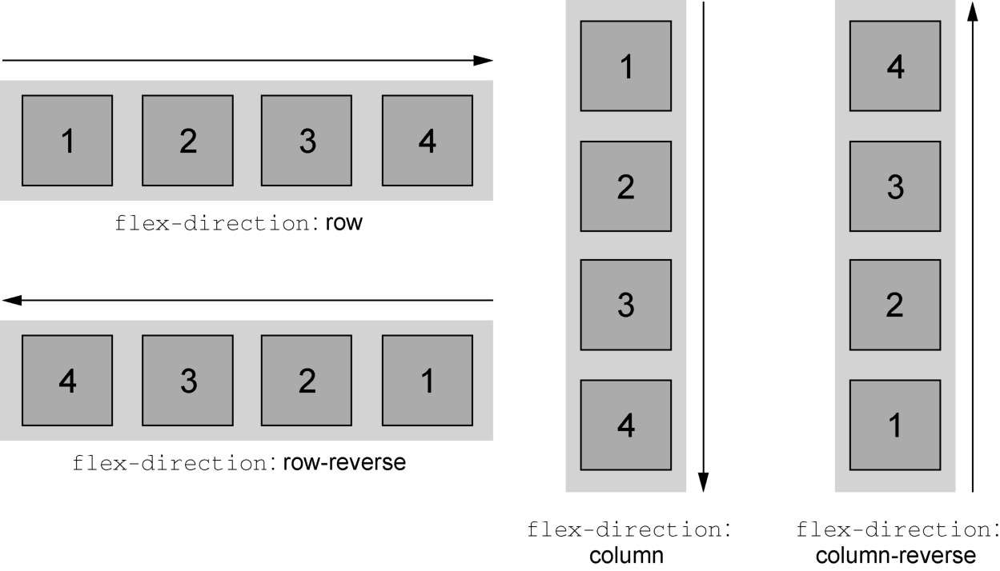

## 弹性方向

Flexbox 的另一个重要功能是能够切换主轴方向，用弹性容器的 flex-direction 属性控制。flex-direction 的初始值（row）控制子元素按从左到右的方向排列；指定`flex-direction: column;`能控制弹性子元素沿垂直方向排列（从上到下）。

在 CSS 中处理高度的方式与处理宽度的方式在本质上不一样。弹性容器会占据 100%的可用宽度，而高度则由自身的内容来决定。即使改变主轴方向，也不会影响这一本质。

弹性容器的高度由弹性子元素决定，它们会正好填满容器。在垂直的弹性盒子里，子元素的 flex-grow 和 flex-shrink 不会起作用，除非有“外力”强行改变弹性容器的高度。
