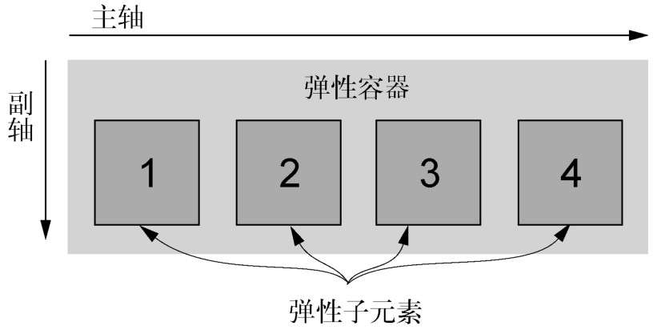

# Flexbox

Flexbox，全称弹性盒子布局（Flexible Box Layout），是一种新的布局方式。跟浮动布局相比，Flexbox 的可预测性更好，还能提供更精细的控制。它也能轻松解决困扰我们许久的垂直居中和等高列问题。

## Flexbox 的原则

给元素添加`display: flex;`，该元素变成了一个**弹性容器**（flex container），它的直接子元素变成了**弹性子元素**（flex item）。弹性子元素默认是在同一行按照从左到右的顺序并排排列。弹性容器像块元素一样填满可用宽度，但是弹性子元素不一定填满其弹性容器的宽度。弹性子元素高度相等，该高度由它们的内容决定。

> 提示
>
> 还可以用`display: inline-flex;`。它创建了一个弹性容器，行为类似于 inline-block 元素。它会跟其他行内元素一起流式排列，但不会自动增长到 100%的宽度。内部的弹性子元素跟使用`display: flex;`创建的 Flexbox 里的弹性子元素行为一样。

一个弹性容器能控制内部元素的布局。

子元素按照**主轴**线排列，主轴的方向为**主起点**（左）到**主终点**（右）。垂直于主轴的是**副轴**。方向从**副起点**（上）到**副终点**（下）。这些轴的方向可以改变。

Flexbox 允许使用 `margin: auto;` 来填充弹性子元素之间的可用空间。
