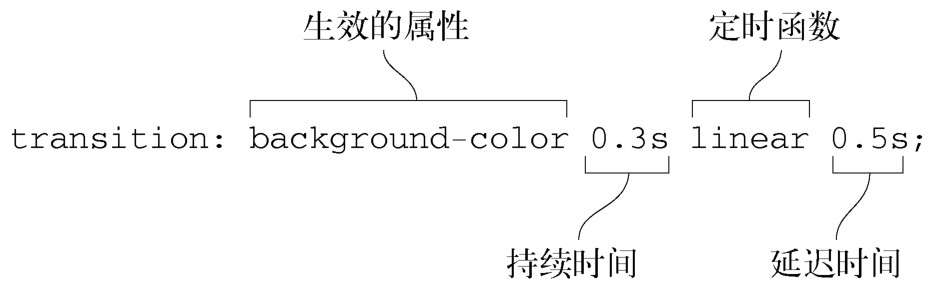

# 过渡

transition-property 属性可以指定哪些属性使用过渡，初始值是关键字 all，表示所有属性都生效。

transition-duration 属性代表过渡到最终值之前需要多长时间。

简写属性：transition，该属性接受四个参数值，分别代表四个过渡属性 transition-property、transition-duration、transition-timing-function 和 transition-delay。

transition-timing-function 属性可以指定一个定时函数，用来控制属性的中间值如何计算，实际上控制的是过渡过程中变化率如何加速或者减速。
transition-delay 属性是延迟时间，允许开发者在属性值改变之后过渡生效之前设置一个等待周期。如果你为按钮的悬停状态设置 0.5s 的过渡延迟，那么在鼠标指针进入元素 0.5s 之后才会开始发生变化。

## 定时函数

定时函数用来说明元素该如何移动。

### 理解贝塞尔曲线

定时函数是基于数学定义的贝塞尔曲线。浏览器使用贝塞尔曲线作为随时间变化的函数，来计算某个属性的值。
